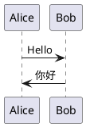

# mdbook-kubook

## prerequisites

- java
- [plantum.jar](https://plantuml.com/zh/download)

## install mdbook-kubook

```
$ cargo install mdbook-kubook
```

## book.toml

```
[preprocessor.kubook]
command = "mdbook-kubook"
renderer = ["html"]
java-path="/usr/bin/java"
plantuml-jar="/usr/local/share/plantuml.jar"
```

## example diagrams

code block with plantumlsvg and plantumltxt

### code block lang: plantumlsvg

```plantumlsvg
@startuml
Alice->Bob : Good Great
Bob->Alice: 2019
@enduml
```

### code block lang: plantumltxt


```plantumltxt
@startuml
actor Foo1
boundary Foo2
control Foo3
entity Foo4
Foo1 -> Foo2 : To boundary
Foo1 -> Foo3 : To control
Foo1 -> Foo4 : To entity
@enduml
```

### code block lang: plantuml


